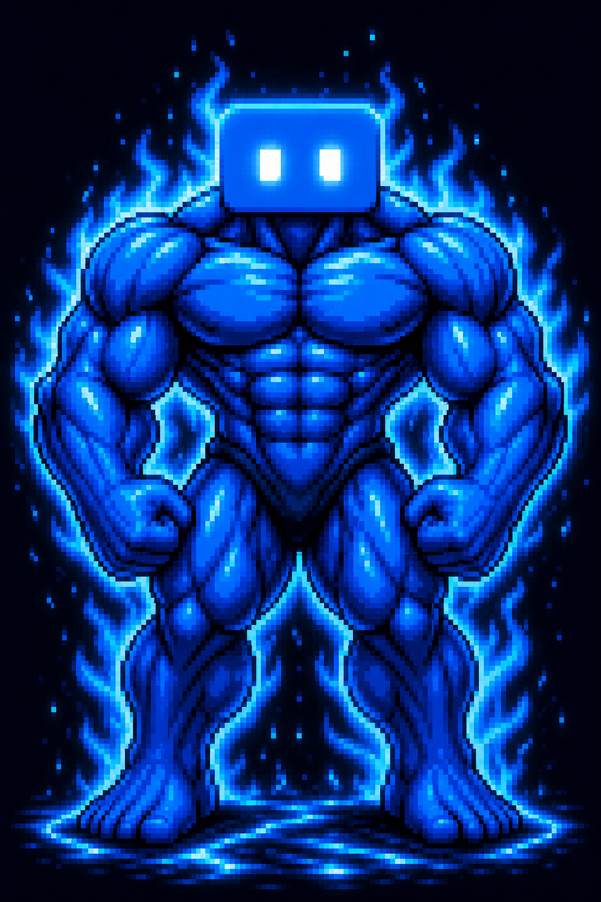

<div align="center">



# oh-my-kimi (omk)

**Kimi-only orchestration runtime for reproducible AI coding teams**

Turn [Kimi CLI](https://github.com/MoonshotAI/kimi-cli) into visible agent swarms with durable state, recovery, and proof.

*Inspired by [oh-my-claudecode](https://github.com/yeachan-heo/oh-my-claudecode), but not a line-for-line port. OMK is designed as a Kimi-native runtime that owns scheduling, state, verification evidence, and observability while Kimi remains the execution engine.*

[](https://github.com/ekhodzitsky/oh-my-kimi/actions)
[](https://github.com/ekhodzitsky/oh-my-kimi/releases)
[](https://codecov.io/gh/ekhodzitsky/oh-my-kimi)
[](https://crates.io/crates/omk)
[](LICENSE)
[](https://www.rust-lang.org)
[](#positioning)
[](#north-star-demo)
[](#maturity)

[Quick Start](#quick-start) - [Features](#features) - [North Star](#north-star-demo) - [Roadmap](#roadmap) - [Spec](SPEC.md) - [TODO](TODO.md)

</div>

---

## Agent Swarm For Kimi CLI

OMK is a Kimi-first runtime for developers who want multiple AI workers without losing control of the run. It coordinates real `kimi` processes through tmux panes, durable state files, and explicit lifecycle commands.

The product wedge is **Agent Swarm for Kimi CLI**:

- start a visible team of Kimi workers from one command;
- inspect the run instead of trusting a black-box chat transcript;
- recover or fail stuck workers cleanly;
- build toward proof-based completion instead of "looks done" vibes.

The near-term roadmap turns the current team runtime into **Kimi Pro Mode**: sync Kimi assets, run a Kimi swarm, watch it live, recover stuck workers, and produce a proof that explains whether the work is actually done.

OMK is independent of Moonshot AI, Kimi CLI, and oh-my-claudecode.

## Quick Start

```bash
# Install
cargo install omk
# or
curl -fsSL https://raw.githubusercontent.com/ekhodzitsky/oh-my-kimi/master/install.sh | bash

# Create OMK config/state directories
omk setup

# Validate the local environment
omk doctor

# Sync current Kimi-native OMK assets
omk kimi sync
omk kimi doctor

# Spawn a current MVP team
omk team spawn 3:coder "refactor authentication to use JWT"
omk team status <name-from-output>
omk team shutdown <name-from-output>
```

## Positioning

OMK borrows useful workflow vocabulary from OMC, then moves it toward a Kimi-first runtime:

- Kimi remains the primary execution engine.
- Rust owns process control, state, retries, verification, and observability.
- Current commands are documented separately from roadmap commands.
- Provider-neutral workers are deferred until the Kimi-only loop is reliable and polished.

Prior art exists and validates demand. The detailed competitor scan lives in [SPEC.md](SPEC.md); the public README stays focused on what OMK is and how to try it.

## Maturity

| Label | Meaning |
| --- | --- |
| Current | Implemented in the CLI today. |
| MVP | Usable, but still needs hardening and real-world validation. |
| Scaffold | Command or module exists, but deeper integration is incomplete. |
| Next | Planned for the Kimi-only killer demo. |
| Later | Deferred until the Kimi-only runtime is excellent. |

## Features

| Surface | What it does | Status |
| --- | --- | --- |
| Team spawn | Spawn N Kimi agents in tmux panes with JSONL inbox/outbox files. | Current MVP |
| Kimi sync | Sync OMK Kimi assets into `.kimi/` and user-level Kimi locations, with a project manifest. | Current Scaffold |
| Kimi doctor | Validate Kimi-native project assets and suggest fixes. | Current Scaffold |
| Autopilot | Six-phase autonomous execution with resume/yolo. | Current MVP |
| Ralph | Persistent verify/fix loop with resume/yolo. | Current MVP |
| Ultrawork | Parallel burst execution without tmux team. | Current MVP |
| Skills | Bundled and user-installable skill definitions. | Current MVP |
| Marketplace | Curated skill registry support. | Current |
| Cost tracking | Heuristic cost estimation across modes. | Current MVP |
| Notifications | Discord, Slack, and Telegram event formatting. | Current MVP |
| HUD | Tmux statusline, TUI, and web dashboard scaffold. | Current Scaffold |
| MCP server | Basic Model Context Protocol server. | Current Scaffold |
| Kimi rollback | Expose manifest-backed rollback and backup restore in the CLI. | Next |
| Team run | Polished Kimi-only entrypoint with scheduler-owned claims and watchdogs. | Next |
| Proof | Final readiness report from event logs and verification gates. | Next |
| Run show | Timeline inspection for a recorded run. | Next |
| Cross-provider workers | Other provider workers/advisors after the Kimi-only runtime is excellent. | Later |

## North Star Demo

These commands are the near-term target, not the fully available CLI surface today:

```bash
omk kimi sync
omk team run "fix all failing tests and produce a proof"
omk hud
omk proof latest
```

The demo is successful when a user can see Kimi workers progressing in parallel, watch a stuck worker recover or fail cleanly, and inspect a final proof with changed files, gates run, failures, retries, known gaps, and final readiness.

## Architecture

```text
User -> omk (Rust) -> tmux -> Lead Kimi
                         |-> Worker Kimi
                         |-> Worker Kimi
                         |-> Worker Kimi

Runtime state:
- team-state.json
- worker-spec.json
- inbox.jsonl / outbox.jsonl
- heartbeat.json
- future event-log.jsonl and proof.json
```

OMK is an external orchestrator. It does not fork or patch Kimi CLI. It spawns real `kimi` processes, coordinates them through state files, and lets you attach to any session with standard tmux commands.

Read more in [SPEC.md](SPEC.md), [ROADMAP.md](ROADMAP.md), [TODO.md](TODO.md), [docs/ARCHITECTURE.md](docs/ARCHITECTURE.md), and [docs/REGISTRY.md](docs/REGISTRY.md).

## Commands

### Kimi Native

```bash
omk kimi sync
omk kimi doctor
omk kimi install
omk kimi agents
omk kimi hooks
omk kimi skills
```

`omk kimi rollback` is planned, but not current.

### Team Mode

```bash
omk team spawn 3:coder "fix all TypeScript errors"
omk team list
omk team status <name>
omk team attach <name>
omk team broadcast <name> "status?"
omk team shutdown <name>
```

`omk team run` is the planned polished replacement/wrapper for the Kimi-only killer path.

### Autopilot And Ralph

```bash
omk autopilot "build a REST API for task management"
omk autopilot --resume --name ap-xxx "build a REST API"

omk ralph "migrate from Express to Fastify"
omk ralph --max-iterations 5 "update all dependencies"
```

### HUD

```bash
omk hud --tmux
omk hud --tui
omk hud --web --port 8080
```

### Maintenance

```bash
omk config validate
omk config show
omk cleanup --older-than 7
omk backup create
omk backup list
omk backup restore 20260507-121530
omk state export --output my-state.json
omk state import --input my-state.json
```

### Secondary Surfaces

These are useful, but not the current product wedge:

```bash
omk ask kimi "review my API design"
omk ask all "architecture for real-time chat"
omk marketplace list
omk marketplace install rust-expert
omk ultrawork --help
```

## Development

```bash
git clone https://github.com/ekhodzitsky/oh-my-kimi
cd oh-my-kimi

make check
make release
make install
```

We follow spec-driven development and TDD. See [SPEC.md](SPEC.md) and [CONTRIBUTING.md](CONTRIBUTING.md).

## Troubleshooting

| Issue | Solution |
| --- | --- |
| `kimi not found` | Install and authenticate [Kimi CLI](https://github.com/MoonshotAI/kimi-cli). |
| `tmux not found` | Install tmux with `brew install tmux` or `apt install tmux`. |
| `omk team spawn` hangs | Run `omk doctor`, then check Kimi auth, tmux availability, and worker heartbeats. |
| Kimi-native assets look stale | Run `omk kimi doctor`, then `omk kimi sync`. |
| State corruption | Use `omk backup create` before destructive cleanup, then `omk cleanup --all` if needed. |
| Resume after crash | Use mode-specific `--resume` flags where available. |

## Roadmap

The near-term roadmap is intentionally Kimi-only:

- Current: stabilize existing CLI, Kimi asset sync, team spawn, HUD scaffold, and diagnostics.
- Next: Kimi rollback CLI, backup restore, manifest checksums, `omk team run`, event logs, `omk run show`, `omk proof`, watchdog recovery, and demo fixtures.
- Later: provider-neutral workers after the Kimi-only runtime proves itself.

See [ROADMAP.md](ROADMAP.md) for the detailed plan.

## License

MIT © oh-my-kimi contributors
